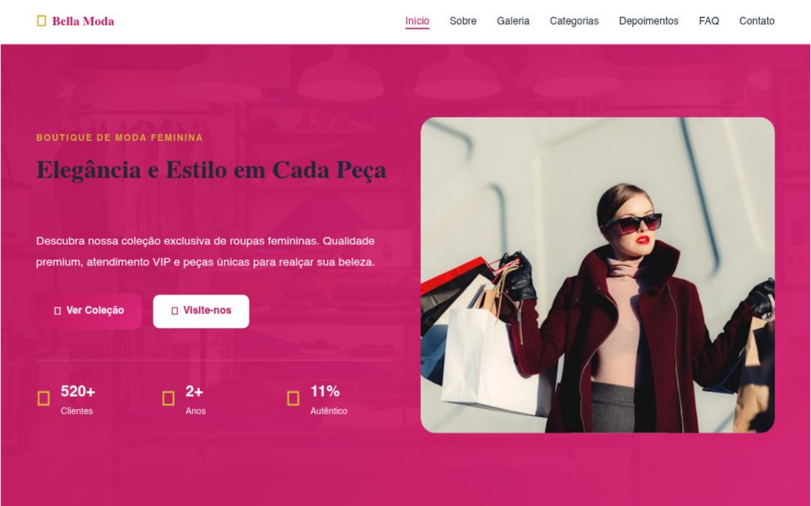

# 👕 Loja de Roupas - E-commerce Front-End

> Uma interface moderna e elegante para uma loja de roupas, focada em exposição de produtos e experiência de compra fluida.

## 🔗 Demonstração
**Veja o projeto online:** [Acesse aqui](https://loja-de-roupas-three.vercel.app/)

---

## 💻 Sobre o Projeto
Este projeto simula um e-commerce de moda, onde apliquei conceitos de **Design de Interface (UI)** para criar um ambiente visualmente atraente que valoriza as peças de vestuário. O objetivo principal foi trabalhar com layouts complexos de exibição de produtos e garantir que a navegação seja intuitiva para o usuário.

## 🛠️ Tecnologias Utilizadas
- **HTML5:** Estrutura clara e organizada.
- **CSS3:** Estilização avançada, com foco em tipografia e harmonia de cores.
- **Flexbox/Grid:** Para um catálogo de produtos perfeitamente alinhado.
- **Vercel:** Deploy e hospedagem.

## 🎨 Diferenciais Técnicos
- **Catálogo Visual:** Exposição de produtos com imagens de alta qualidade e descrições claras.
- **Responsividade:** O site se ajusta para que o usuário possa "comprar" pelo celular ou desktop.
- **Estética Profissional:** Layout clean que remete às grandes marcas do mercado de moda.

## 📸 Preview

---
### 👨‍💻 Contato
**Matheus Rodrigues** [LinkedIn](https://www.linkedin.com/in/matheus-rodrigues-4398423b9) | [GitHub](https://github.com/mathrodriguesdev-arch)
